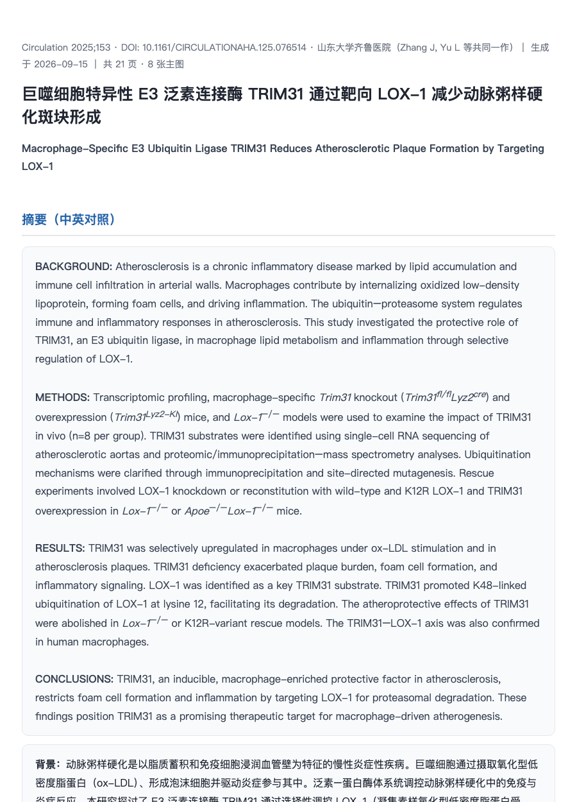

# paper-digest — 单篇学术 PDF → 中文深度解读 HTML

给一篇学术 PDF，产出一个**单文件、可分享的中文深度解读网页**：

- 题目与摘要：英文原文 + 中文翻译（对照）
- 研究背景与科学问题
- 方法要点
- 重点总结（核心发现）
- **逐图解读**：自动从 PDF 裁出每张主图，AI 真正"看图"后写解读（做了什么 / 怎么做 / 结果说明什么），图文对照
- 局限性与批判性评价（作者自述 + 阅读者视角）

最终产物是一个 HTML 文件，图片全部内嵌，微信/邮件/浏览器直接打开，无需任何依赖。



## 工作原理

```
PDF ──(PyMuPDF 确定性提取)──> 逐页文本 + 图注定位 + 逐图裁剪 PNG + 清单
                                   │
                                   ▼
                        AI Agent 精读全文 + 逐图看图
                                   │
                                   ▼
                    自包含解读 HTML（base64 内嵌图）+ 内容质检
```

设计原则：**脚本只做确定性提取，理解交给 AI**。图注定位不依赖脆弱的关键词
（部分期刊首页没有 "Abstract" 字样），识别一律以语义为准。

## 安装

需要：支持 Agent Skills 的编码智能体客户端（如 ZCode）、python3。

```bash
# 1. 克隆到 skills 目录（Windows 用户为 %USERPROFILE%\.zcode\skills\paper-digest）
git clone https://github.com/<你的用户名>/paper-digest.git ~/.zcode/skills/paper-digest

# 2. 安装 PDF 依赖
python3 -m pip install --user PyMuPDF

# 3. 重启客户端会话（skill 列表在会话启动时扫描）
```

不想用 git 也可以：在 GitHub 页面 **Code → Download ZIP**，解压后把
`paper-digest` 文件夹放进 `~/.zcode/skills/` 即可。

## 使用

新开会话后，任选其一：

**自然语言触发**（推荐，不用记命令）：

```
帮我解读 /path/to/xxx.pdf
文献解读这篇，输出到 ~/Desktop，详细档
```

**显式调用**：输入框敲 `$paper-digest`。

常用参数（自然语言说明即可）：

| 需求 | 说法示例 |
|------|----------|
| 补充图也解读 | "补充图也要"（脚本层 `--include-supp`）|
| 图注没识别全 | "手动指定图在第 4、6、8 页"（`--pages 4,6,8`）|
| 速览 / 精读 | "速览版" / "精读档" |
| 指定输出位置 | "输出到 ~/Desktop" |

## 已知边界

- **扫描版 PDF（无文本层）不支持**——脚本会明确告警，请先 OCR；
- 加密 PDF 不支持；
- 跨页大图目前裁到主体所在页（恢复表里有手动方案）；
- 每次解读一篇；多篇请循环调用（批量模式在 roadmap 里）；
- AI 解读仅供参考，数据与结论请以原文为准（报告 footer 已自带此声明）。

## 项目结构

```
paper-digest/
  SKILL.md                      # agent 契约：触发词、执行路径、质检门、失败恢复
  metadata.yml                  # 机读描述
  templates/
    script-skeleton.py          # PDF 提取脚本（文本/图注/裁图，真跑验证过）
    report-template.html        # 解读报告版式
  examples/                     # 真实运行 trace 与产物结构说明
  errorbook.md                  # 开发/运行中踩过的坑
```

## License

MIT
